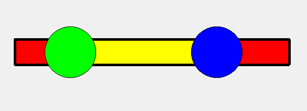

# CstmDoubleHandleSlider

 
 This class provide a two handles slider .You have a very high degree of freedom to modify the various properties of the slider.
 
 You can use the function to set the slider is Horizontal or Vertical.

	 void setIsHorizontal(bool value);

  
 
 You can set the thickness of the slider. If the slider is Horizontal the thickness holds the Height of the slider, of Width of the slider while is Vertical.You can also the set Color of the slider and the Border,of course you can change the width of border .

	void setSliderThickness(int value);
	void setSliderColor(const QColor &value);
	void setBorderWidth(int value);
	void setBorderColor(const QColor &value);

 
 
 For the Handle. you can set the handle color, selected color, border color, shape, border width, handle width,hand height.
    
    void setHand1Color(const QColor &value);
    void setHand1SelectedColor(const QColor &value);
    void setHand1BorderColor(const QColor &value);
    void setHand1BorderWidth(int value);
    void setHand1Width(int value);
    void setHand1Height(int value);
    void setHand1Style(const SliderStyle &value);

    void setHand2Color(const QColor &value);
    void setHand2SelectedColor(const QColor &value);
    void setHand2BorderColor(const QColor &value);
    void setHand2BorderWidth(int value);
    void setHand2Width(int value);
    void setHand2Height(int value);
    void setHand2Style(const SliderStyle &value);
 
 NOTE: If the shape of the handle is Circle, Only the height  is effective. You can set kindle of shaples to the two handles.
 

  
 You can set the Max and Min value. and you can also set the valus of the handles.
 
	 void setMaxValue(double value);
	 void setMinValue(double value);
	 void setHand1Value(double value); //slot
	 void setHand2Value(double value); //slot
	 
 
 If you Press the space between the handles, the both handles would slide.
 
 And also you can set the color between the handles, and the selected color.

	void setMidSelectedColor(const QColor &value);
	void setMidColor(const QColor &value);
 

 
 If the value of the handle changed , it would emit a signal.
	
	void signal_hand1ValueChanged(qreal value);
	void signal_hand2ValueChanged(qreal value);