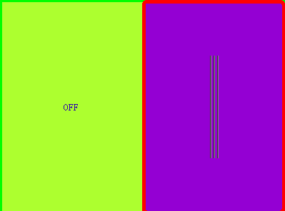

# CstmSliderSwitch

 CstmSliderSwitch is a switch control, you can click the switch to change the status.

 You can use the function to change the status,and the function is a slot .

	void setSwitchStatus(bool value);

 The control emit a signal while the status changed by click.

	void StateChanged(bool state);

 You can custom the switch by those functions :

	void setSwitchIsRounded(bool value);
	void setSwitchBorderCorlor(const QColor &value);
	void setSwitchBorderWidth(int value);
	void setSliderCorlor(const QColor &value);
	void setSliderBorderCorlor(const QColor &value);
	void setSliderBorderWidth(int value);
	void setOnStateCorlor(const QColor &value);
	void setOffStateCorlor(const QColor &value);
	void setOnStateString(const QString &value);
	void setOffStateString(const QString &value);
	void setTextCorlor(const QColor &value);
	void setTextfont(const QFont &value);
