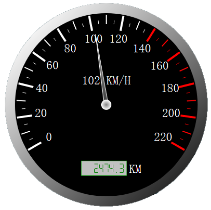

# CstmSpeedPanel

 
 CstmSpeedPanel is a widget provide a speed panel,like a spped panel of a car

 
 This widget was created by flist (https://github.com/flistliu )
 
 
 If you want to change the size of widget , or other configurations , you can changed the value in the Constructor. It is different from other controls.
	
 
 This widget only provide a slot to change the value of the spped, so you can use the function to change.

    void setCurentSpeed(int speed);
