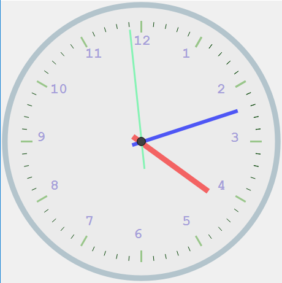
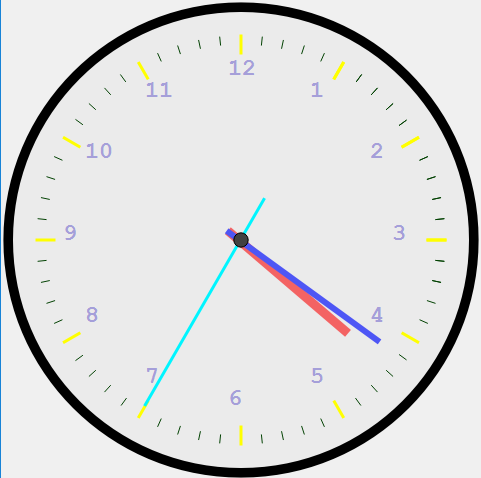

#CstmTimepanel

>use this class to construct a clock panel.


Function
```
void setColor(Item item,QColor color);
```
to set items color.
```
    enum Item{
        item_CentralPoint,
        item_CentralPanel,
        item_Margin,
        item_5Minute,
        item_perMinute,
        item_IndicatorHour,
        item_IndicatorMinute,
        item_IndicatorSecond,
    };
```
##results:


