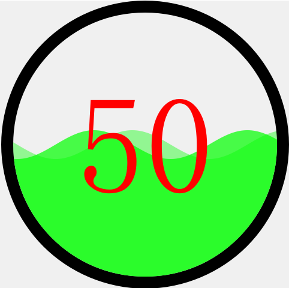

#CstmWaveProgress

 
 CstmWaveProgress is a widget provide a wave shape progress.

 
 This Class was refer the code at http://blog.csdn.net/feiyangqingyun/article/details/77529065 , I add and changed some code to archive this Class.
 
 
 You can use this function to set the shape of the progress.The value is a enum, there are only 3 value you can use
	
	{  WidgetStyle_Rect,
	   WidgetStyle_Circle,  
	    WidgetStyle_Ellipse }
	    
	void setWidgetStyle(const WidgetStyle &value);

 
 Also you can use the follow functions to change the wave color and the border color, and you can also change the width of the border.

	void setBorderWidth(int value); //default 20
	void setWaveColor(const QColor &value); //default "#00FF00"
	void setBorderColor(const QColor &value); //default "#000000"

 
 You can set the value of the progress by those functions .

	void setCurrentValue(double value);    //default 50
	void setMinValue(double value);      //default 0
	void setMaxValue(double value);      //default 100
 
 
NOTE: 
 1.  If you set the MaxValue is lower than the MinValue ,The MinValue would changed to The MaxValue you setted.
 2. If you set the MinValue is greater than the MaxValue, The MaxValue would change to the MinValue you setted.
 3. If the CurrentValue is less than the MinValue , the CurrentValue would setting to the MinValue;
 4. If the CurrentValue is greater than the MaxValue , the CurrentValue would setting to the MaxValue;
 5. The Function  "void setCurrentValue(double value);" is a public slots.

 
 The function is to set the Height percentage of he wave.
	 
	 void setWaterHeight(double value); //default  5, min 0.

 
 The function is to set the Density of he wave.

	void setWaterDensity(double value);//default 5,min 0

 
 The function is to set the update time space.

	void setUpdataTime(int value);//default is 50, min is 0 , but if the value is o ,the wave is statics.

 
 The function is to the the offset between update time. If the offset is less than 0, the wave is left to right, greater than 0,
the wave is right to left , the offset is 0, the wave is statics.

	void setOffset(double value);
